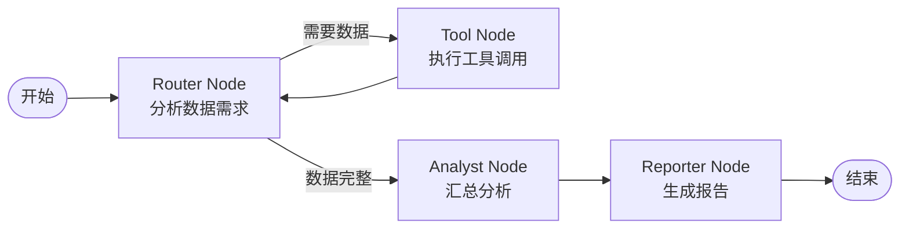

# Deep Research Agent for Job Interview Prep

> 一个基于 **LangGraph** 的硬核深度调研智能体，自动化分析目标公司的技术栈、业务动态和面试经验，生成包含 **ECharts 可视化**的专业报告。


## ✨ 特性

- **🔄 智能工作流编排**: 基于 LangGraph StateGraph 的多节点协作
- **🔍 多数据源集成**: GitHub API + Tavily Search
- **📊 技术栈可视化**: 自动生成 ECharts 饼图配置
- **🤖 LLM 深度分析**: 支持 OpenAI/Anthropic 模型进行智能分析
- **🛡️ 健壮的错误处理**: API 限流、网络重试、默认值兜底
- **📝 专业报告输出**: 结构化 Markdown 格式

## 🏗️ 项目架构

```
DeepResearchAgent_JobInterviewPrep/
├── src/                        # 源代码
│   ├── __init__.py
│   ├── state.py                # Agent 状态定义 (TypedDict)
│   ├── config.py               # 配置管理
│   ├── graph.py                # LangGraph 工作流
│   ├── nodes/                  # 节点实现
│   │   ├── __init__.py
│   │   ├── router.py           # 路由节点
│   │   ├── tools.py            # 工具执行节点
│   │   ├── analyst.py          # 分析节点
│   │   └── reporter.py         # 报告生成节点
│   ├── tools/                  # 工具实现
│   │   ├── __init__.py
│   │   ├── github_tool.py      # GitHub API 工具 ⭐
│   │   └── tavily_tool.py      # Tavily 搜索工具
│   └── utils/                  # 工具类
│       ├── __init__.py
│       ├── llm.py              # LLM 初始化
│       └── charts.py           # 图表生成
├── tests/                      # 测试
│   ├── __init__.py
│   └── test_tools.py
├── requirements.txt            # 依赖清单
├── .env.example                # 环境变量模板
└── README.md                   # 本文件
```

## 🔄 工作流设计



### 节点说明

| 节点 | 功能 | 核心逻辑 |
|------|------|----------|
| **Router** | 意图路由 | 检查数据完整性，决定下一步 |
| **Tools** | 工具调用 | 并行调用 GitHub/Tavily API |
| **Analyst** | 数据分析 | LLM 汇总分析，提取洞察 |
| **Reporter** | 报告生成 | 生成 Markdown + ECharts 配置 |

## 🚀 快速开始

### 1. 安装依赖

```bash
# 克隆项目
cd DeepResearchAgent_JobInterviewPrep

# 创建虚拟环境
python -m venv venv
source venv/bin/activate  # Windows: venv\Scripts\activate

# 安装依赖
pip install -r requirements.txt
```

### 2. 配置环境变量

```bash
# 复制配置模板
cp .env.example .env

# 编辑 .env，填入你的 API Keys
# 必需: TAVILY_API_KEY
# 推荐: GITHUB_TOKEN, OPENAI_API_KEY
```

### 3. 运行示例

```python
from src.graph import run_research_agent

# 方式 1: 直接运行
result = run_research_agent("DeepSeek")

# 方式 2: 获取 Markdown 报告
from src.graph import get_markdown_report
report = get_markdown_report("ByteDance")

# 保存报告
with open("report.md", "w", encoding="utf-8") as f:
    f.write(report)
```

### 4. 命令行运行

```bash
python -m src.graph DeepSeek
```

## 📊 核心功能详解

### GitHub Stats Tool (`src/tools/github_tool.py`)

**功能**:
1. 搜索公司的 GitHub 组织
2. 获取 Top N 热门仓库（按 stars）
3. 计算编程语言分布
4. 生成 ECharts 饼图配置

**关键代码**:
```python
from src.tools.github_tool import GitHubStatsTool

tool = GitHubStatsTool(github_token="your_token")
stats = tool.run("DeepSeek", top_n=5)

print(stats["language_distribution"])
# [
#   {"language": "Python", "percentage": 60.0, "repository_count": 3},
#   {"language": "Go", "percentage": 40.0, "repository_count": 2}
# ]

print(stats["echarts_config"])
# ECharts JSON 配置
```

**错误处理**:
- 组织不存在 → 返回默认值
- API 限流 → 自动重试 3 次
- 网络超时 → 超时控制 + 日志记录

### 报告示例输出

```markdown
# DeepSeek 求职备战深度调研报告

## 💻 技术栈分析

**GitHub 组织**: [deepseek-ai](https://github.com/deepseek-ai)
**开源仓库总数**: 42

### 编程语言分布
| 语言 | 占比 | 仓库数 |
|------|------|--------|
| Python | 60.0% | 3 |
| Go | 40.0% | 2 |

### 🔥 热门开源项目
1. **[deepseek-coder](https://github.com/deepseek-ai/deepseek-coder)**
   - ⭐ Stars: 5234
   - 🏷️ 语言: Python
   - 📝 描述: An open-source LLM for code

### 📈 技术栈可视化
```json
{
  "title": {"text": "deepseek-ai - 技术栈分布"},
  "series": [{"type": "pie", "data": [...]}]
}
```

## 🧪 测试

```bash
# 运行所有测试
pytest tests/

# 运行特定测试
pytest tests/test_tools.py::TestGitHubStatsTool -v

# 查看覆盖率
pytest --cov=src tests/
```

## 🎯 使用场景

1. **求职备战**: 快速了解目标公司的技术栈和面试重点
2. **竞品分析**: 分析竞争对手的开源策略
3. **行业研究**: 批量分析多家公司生成行业报告
4. **投资调研**: 评估公司的技术实力和活跃度

## 🔧 自定义扩展

### 添加新的数据源

1. 创建新工具类 `src/tools/custom_tool.py`
2. 实现 `run()` 方法
3. 在 `src/nodes/tools.py` 中调用

### 自定义 LLM Prompt

修改 `src/nodes/analyst.py` 中的 `_generate_llm_analysis()` 函数。

### 修改报告格式

修改 `src/nodes/reporter.py` 中的 `_generate_markdown_report()` 函数。

## 📝 技术亮点

- ✅ **类型安全**: 全面使用 TypedDict + Pydantic
- ✅ **异步重试**: GitHub API 自动重试机制
- ✅ **条件路由**: LangGraph 条件边实现智能决策
- ✅ **可观测性**: 每个节点打印执行日志
- ✅ **模块化设计**: 工具、节点、状态完全解耦

## 🐛 常见问题

**Q: GitHub API 返回 403?**
A: 未配置 GITHUB_TOKEN 或达到速率限制。建议在 .env 中配置 token。

**Q: Tavily 搜索无结果?**
A: 检查 TAVILY_API_KEY 是否正确，或公司名称是否准确。

**Q: LLM 分析失败?**
A: 确保 OPENAI_API_KEY 或 ANTHROPIC_API_KEY 配置正确。

## 📄 License

MIT License

## 🤝 贡献

欢迎提交 Issue 和 Pull Request！

---

**Made with ❤️ by YxmMyth**
